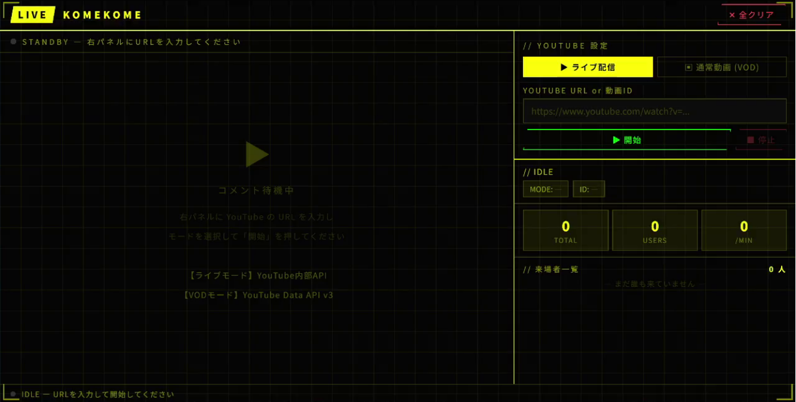

# KomeKome
- YouTubeLiveでコメントを管理したり、OBSに載せるようにデザインを変えて表示する用のアプリです。
  - Live配信後のアーカイブ後のやつにも対応したかったけど、バグが取れなかったので諦めました
- 来てくださったリスナーさんを記録したり、コメントログをテキストに残したりできます。
- スタンプ等は未対応です。

# How to use
## 概要
- Pythonとブラウザが使える環境ならOS問わずどこでも使えます
- 依存はflaskのみ：`pip install Flask`

## 環境構築の方法
1. (Windowsのみ) Pythonを[ここ](https://www.python.org/)からDL＆インストール
2. `pip install Flask`コマンドで依存環境をセットアップ

## 実行方法
1. `python3 app.py`コマンドでシステムを起動
2. ブラウザで`http://localhost:5000`へアクセス
3. 「YOUTUBE URL or 動画ID」欄に配信URLを貼り付け
4. 動く！

# 今後やりたいこと
- 複数のURLからコメントを取り込んで1つの画面にまとめて表示
- 色の設定、フォントの設定をconfigファイルに分ける→デザイン変更に対応させる
- VODモードはややこしいのできっぱり諦めて削除
- スタンプ対応
- 使用するポート番号をconfigファイルに分ける→ポートの衝突回避

